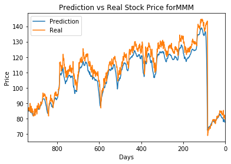
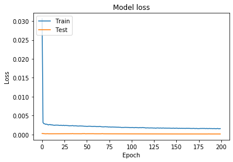

Mostly just a proof of concept, these models (as used in this repo) are not suitable for actual trading.

Example of a mostly-fitted model's predictions on the training data. 

Note there is likely overfitting at play here, since I am selecting for models which perform well on the test data. For live use, these models should be trained to predict percent changes in closing price, versus the closing price outright.
